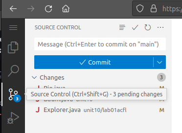
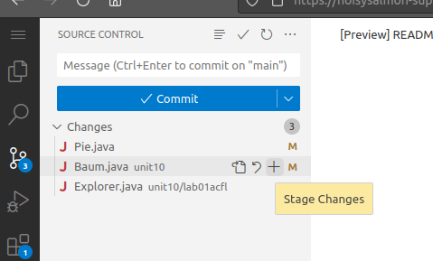
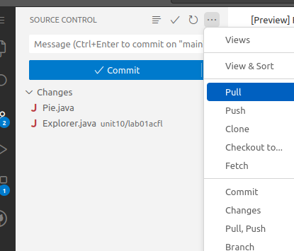

# Version Control HOWTO

GitHub uses [Git](https://git-scm.com/) for Version Control. Git is an industry standard, and [Git can be tricky](https://blog.upperlinecode.com/how-to-teach-git-commits-github-to-teenagers/).

VS Code tries to make it a bit easier. It still can be tricky. :)

To access version control, select the icon from the left navbar. It looks like a mini-tree.

Then, saving your code is a 2-step process.
To commit your code, first stage your changes by clicking the ➕ icon:

Do this for all files you'd like to save.

After staging your changes, you can commit them. Enter a message, and click the button.

VS Code may ask if you'd like to periodically run `git fetch`. Sure, this seems fine.

After you have saved your changes, use "Push" to send them to GitHub, and "Pull" to retrieve new changes from your GitHub repo to your Codespace (or local machine). These are both within the `...` menu at the top:

If it gives you an error ending in `fatal: Need to specify how to reconcile divergent branches.` then I suggest the `# rebase` option. Copy+Paste+Enter into your "Terminal" window (bottom):

- `git config --global pull.rebase true`

Maybe this is sufficient to get you unstuck?

## Git, Java in Visual Studio Code on Windows (without Admin) HOWTO

If you have Admin rights, just install normal Git and normal Java. ([Recommended](https://whichjdk.com/) is [Adoptium](https://adoptium.net/temurin/releases/) OpenJDK version 17)

1. Visit [Git Downloads](https://git-scm.com/download/windows) and choose the "Portable" edition.
2. Download and unzip this on your computer somewhere, like a "Git" folder in your home directory.
3. Within VS Code Settings, search for "git path" and then edit within settings.json. Per [StackOverflow](https://stackoverflow.com/questions/71515762/use-portable-vscode-with-portable-git), set `"git.path"` to `"C:\\Users\\XXX\\Git\\cmd\\git"` replacing XXX with your username (or wherver you unzipped it).
4. Open Command prompt, navigate to this folder, and add some git configuration:
   - `git config --global user.email "youremail@stu.asd103.org"`
   - `git config --global user.name "Firstname Lastname"`
   - `git config --global pull.rebase true`
5. Restart VS Code, visit the "Version Control" tab, select "Clone Repository", and clone your GitHub repo.
