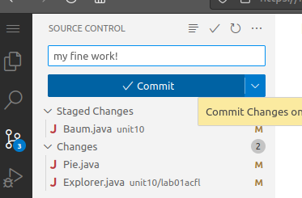

# Version Control HOWTO

GitHub uses [Git](https://git-scm.com/) for Version Control. Git is an industry standard, and [Git can be tricky](https://blog.upperlinecode.com/how-to-teach-git-commits-github-to-teenagers/).

VS Code tries to make it a bit easier. It still can be tricky. :)

To access version control, select the icon from the left navbar. It looks like a mini-tree.


Then, saving your code is a 2-step process.
To commit your code, first stage your changes by clicking the ➕ icon:


Do this for all files you'd like to save.

After staging your changes, you can commit them. Enter a message, and click the button.



VS Code may ask if you'd like to periodically run `git fetch`. Sure, this seems fine.

After you have saved your changes, use "Push" to send them to GitHub, and "Pull" to retrieve new changes from your GitHub repo to your Codespace (or local machine). These are both within the `...` menu at the top:


If it gives you an error ending in `fatal: Need to specify how to reconcile divergent branches.` then I suggest the `# rebase` option. Copy+Paste+Enter into your console window (bottom):

```zsh
git config pull.rebase true
```

Maybe this is sufficient to get you unstuck?
