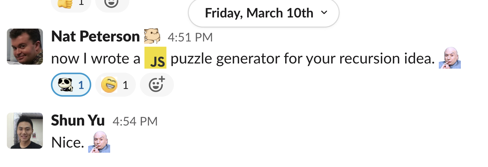

## AP Computer Science A

Tuesday, March 21, 2023

# Unit 10, Lesson 05: Recursive sorts

## Warm-Up: Bell Ringer 16A (recursion)!

As discussed yesterday, these questions ask you to understand, rather than write, recursive functions.

## Recursion Deconstruction

Perhaps we should spend some time practicing analyzing recursive functions.

Please open [`Recur.java`](Recur.java) in your IDE.

#### I. Consider the following recursive function.

```java
public static int fun3(int n) {
    if (n == 0)
        return 1;
    else
        return 3 * fun3(n - 1);
}
```

What value is returned when `fun3(5)` is called?

#### II. Consider the following recursive function.

```java
public static int f(int n) {
    if (n == 0)
        return 0;
    else if (n == 1)
        return 1;
    else
        return f(n-1) + f(n-2);
}
```

What value is returned when `f(6)` is called?

## Recursive sorts

If you read those Wikipedia pages yesterday, they suggested not to use those algorithms.
These are better. Are they the best? What is the premium "sort" algorithm?

There's no "best sort" because sorting is a trade-off.

- Sometimes your input is random. Other times it's already sorted, or nearly sorted.
- Sometimes your input is short. Other times it is very long.
- Sometimes you need to sort "in place". Other times you can allocate more memory. Speed vs. Memory use is a common trade-off in computer science.

So let's explore two recursive sorts. I brought those cards again, and we'll have to work together to be recursive.

- [Merge Sort](https://en.wikipedia.org/wiki/Merge_sort)
- [Quicksort](https://en.wikipedia.org/wiki/Quicksort)

Again, I copied these off the internet, into [Scramble2.java](Scramble2.java).

More Resources:

- [Merge Sort Cards](https://www.youtube.com/watch?v=AMJjtTo1LLE)
- [Merge Sort Dancers](https://www.youtube.com/watch?v=dENca26N6V4)
- [Quicksort Dancers](https://www.youtube.com/watch?v=3San3uKKHgg)

We can use your Shuffle algorithm!

## Homework

Due Thursday, March 23, 2023, as class begins.

On a scale of 1 (I do not understand) to 5 (I could teach this stuff), please consider your comfort with analysing recursive methods.

If you are at a 1, 2, or 3, please choose Option A. I recommend Option B if you are at a 4 or 5. Option C is for anyone 🧙 who feels they are at 6+.

### Option A

Let's continue our analysis of the methods in [`Recur.java`](Recur.java).
For each:

- try to figure out what the method does.
- add printing output to confirm your understanding, OR
- write comments of the input and output to each recursive call.

### Option B

We have sorting algorithms, and they already work. Great!

On Thursday, we will have a sorting lab, but it involves words, not numbers. Please update a sort algorithm of your choosing to sort an array of Strings. You will find the function [`compareTo`](https://docs.oracle.com/javase/8/docs/api/java/lang/Comparable.html#compareTo-T-) helpful in this exercise. (Note that `String` implements `Comparable`.)

Additionally, create a shuffle function for arrays of Strings. What is different from the shuffle for integers? Can you create a shuffle function that works for both `int[]` and `String[]`, perhaps recalling that Java can autobox `int` to `Integer` and both `Integer` and `String` subclass `Object`?
After you have considered this, [see here](https://stackoverflow.com/a/45918658).

### Option C

If you just can't get enough! 🤣

I made you a puzzle generator, on the advice of a co-worker.



Consider an array of integers `puzzle` and a target result `sum`.

```
What combination of +/- will solve this sequence?
int[] puzzle = {4, 10, 1, 6, 10, 9, 4, 2}; int sum = 0;
```

There exists some combination of plus and minus between the numbers which solves the puzzle.
One answer is the following:

- `4 + 10 - 1 - 6 - 10 + 9 - 4 - 2`

Execute [`puzzlegen.js`](puzzlegen.js) (On a Codespace run `node puzzlegen.js` or paste the code into the "Console" tab of your web browser - [HOWTO](https://appuals.com/open-browser-console/)) to generate yourself a puzzle.

Alternatively, here is an "easy" one:

```
What combination of +/- will solve this sequence?
int[] puzzle = {8, 8, 8, 10 }; int sum = 18;
```

Once your code works for that, here is a longer one:

```
What combination of +/- will solve this sequence?
int[] puzzle = {11, 6, 11, 10, 11, 1, 6, 7, 2, 6, 4, 6, 3 }; int sum = 30;
```

Then write a java solution to solve it. We are studying Recursion, so a recursive function would be best, but an iterative solution is acceptable as well.
