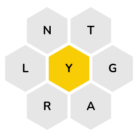

## AP Computer Science A

Thursday, March 23, 2023

# Unit 10, Lesson 06: Sorting and Searching

🚨 Exam delayed until next week. 🚨

### Today in Bullets

- bell ringer (2D arrays)
- succeed with VS Code
- lab: SpellingBee solver
- search algorithms
- homework: Maze FRQ

## Warm-Up: Bell Ringer (2D arrays)

Soon, we'll begin AP Exam boot-camp. Y'all have learned a lot. Where do we need more review/practice? (Besides FRQs...)

## Succeed with Visual Studio Code

Are you having fun in your Codespaces? There are some frustrating bits, to be sure. I started to help a couple of you commit code, so let's see if we can efficiently get everyone set up for success. Efficiently means: I need help!

Liam, could you help, please? Who else is willing to be deputized as a TA for a bit?

Second, Codespaces are nice, but desktop software is better. Optional: [Desktop VSCode HOWTO](../git/Window-NoAdmin.md)

## Mini-Lab: SpellingBee solver. (~30m coding play)

Are you familiar with [SpellingBee](https://www.nytimes.com/puzzles/spelling-bee)? Is it blocked at school? It looks like this:

Here is a lab about that. [Lab 02: SpellingBee](lab02bee/README.md)

## Search (~30m coding together)

Continuing with our SpellingBee code:

- [Linear Search](https://en.wikipedia.org/wiki/Linear_search) (Sequential Search)
- [Binary Search](https://en.wikipedia.org/wiki/Binary_search_algorithm)
  - I'm thinking of a number between ...
  - Can we binary search our SpellingBee solver? Is this better?
    - Generate a prefix, find the first word with this prefix, check just these words.

## Sponge

We have yet to need a Sponge since I showed up, but if we do, how about [Recursive Sorts](10-5.md#recursive-sorts)?

## Homework: Maze FRQ

Due Monday, March 27.

FRQs are more fun when you actually get to code them!

Here is a FRQ (!!) that involves recursion (!!!) and a different sort of searching.

- [Maze FRQ](MazeFRQ.md)
