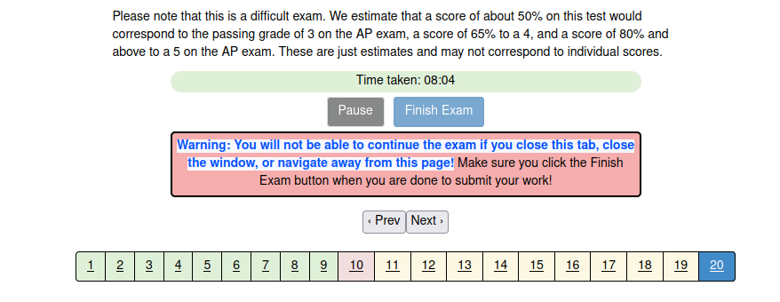

## AP Computer Science A

Tuesday, April 25, 2023

# Unit 11, Lesson 11: 🐝-Review

AP exam [next Wednesday](https://days.to/until/3-may)! 🔜🔜🔜

Let's wind-up [🐝-Review](b/B.md).

Is there more we should cover? 🤔

We could also play [JuiceMind](https://play.juicemind.com/).

## Sponge

Anyone for a game of [dice](dice.md)? 🎲

## Homework

A-ha! Please take [csawesome's 11.1 Post Test](https://runestone.academy/ns/books/published/csawesome/Unit11-posttest/posttest.html). 20 questions of fun! **Take a screenshot of your results, and submit it to Schoology.** You are not graded on how well you do on the Post Test, but rather that you took it. This is due before May 3rd, because c'mon...

Example result, for half-credit (because half are yellow == skipped):

Then, perhaps you have identified a few things to review?

Study for the AP exam! [Active recall](https://www.brainscape.com/academy/active-recall-definition-studying/) is the best way to study.

- [AP Classroom](https://apclassroom.collegeboard.org/)
- [csawesome](https://runestone.academy/ns/books/published/csawesome/index.html)
- [UW Practice-It](https://practiceit.cs.washington.edu/problem/list)
- [CodingBat](https://codingbat.com/java)
