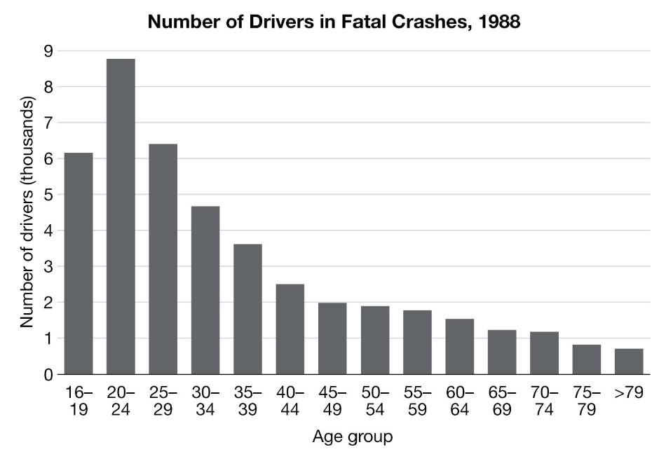
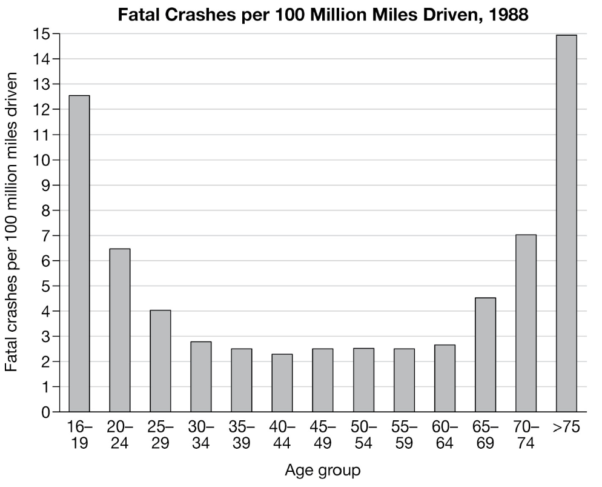

## AP Computer Science A

Thursday, June 15, 2023

# Unit 13, Lesson 6: Fake News

Here's an article [about the life expectancy of musicians](https://theconversation.com/music-to-die-for-how-genre-affects-popular-musicians-life-expectancy-36660).

- Scroll to the chart. What does this tell us?
- Does this seem right to you?

Scroll a bit further to the Cause of death table.

- What does this data tell us?
- Does this seem right to you?

## I thought "Look at the Data" was the solution! (to unfounded claims)

We talked about AI a bit in the last weeks. AI [makes stuff up](https://www.wired.com/story/ai-has-a-hallucination-problem-thats-proving-tough-to-fix/).

Hey, people make stuff up too! Folks call that "Fake News."

The goal of today is to encourage healthy skepticism in what crosses your path.

What does it mean to be skeptical?

To discover the truth, we just consult the data, right?

- Is there data? Where did it come from? How was it collected?
- What aspects of the data are presented?

Here's another chart.

(Source: Bergstrom, Carl T. and West, Jevin D. Calling B\*\*\*S\*\*\*: The Art of Skepticism in a Data-Driven World, Chapter 7)

What do you see here? What do you wonder about?

How about this angle:

If I tell you one-quarter of car accidents involve drunk driving, we don't conclude drunk driving is safer...

## Misuse of Data

As part of our data science unit, I was hoping to get to [this activity](https://docs.google.com/presentation/d/1-sGAeM1lMEDjN7AEejci4Fm8-xEBpM2m4hmdvFrxW_U/edit?usp=sharing).

Charts like these are not just academic. They show up [all the time](https://twitter.com/erikbryn/status/1655943604773482499), once you notice them. ([Debunked?](https://slatestarcodex.com/2016/03/07/reverse-voxsplaining-prison-and-mental-illness/))

### Critical Thinking

Be part of the solution: Be a Skeptic.

- 3 levels: convince yourself, convince a friend, convince a skeptic.

This is computer science?! Absolutely, thinking outside the box.

## Project Showcase

Others you can explore, here: [projects.md](projects.md)

- and if you want to show it off, please do!

## Sponge: Processing

Your Unity demos reminded me of [Processing](https://processing.org/), a system for creative coding.

We'll explore [p5.js](https://p5js.org/) in Coding Club today. [Here's snake! 🐍](https://editor.p5js.org/p5/sketches/Interaction:_snake)
